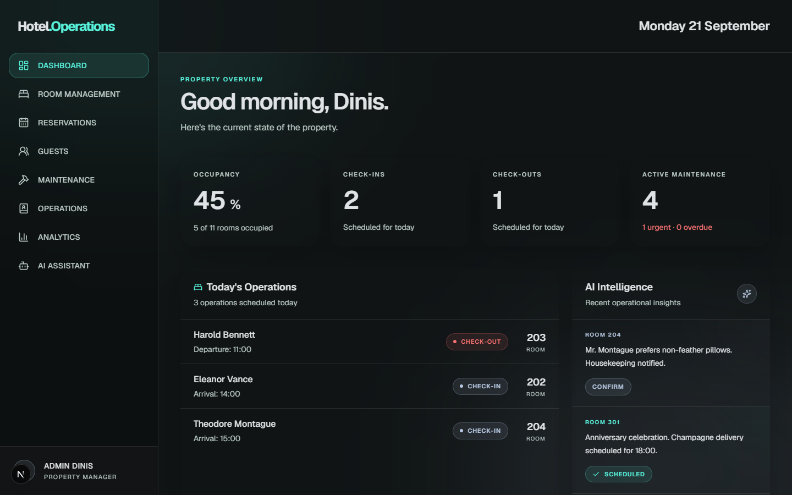
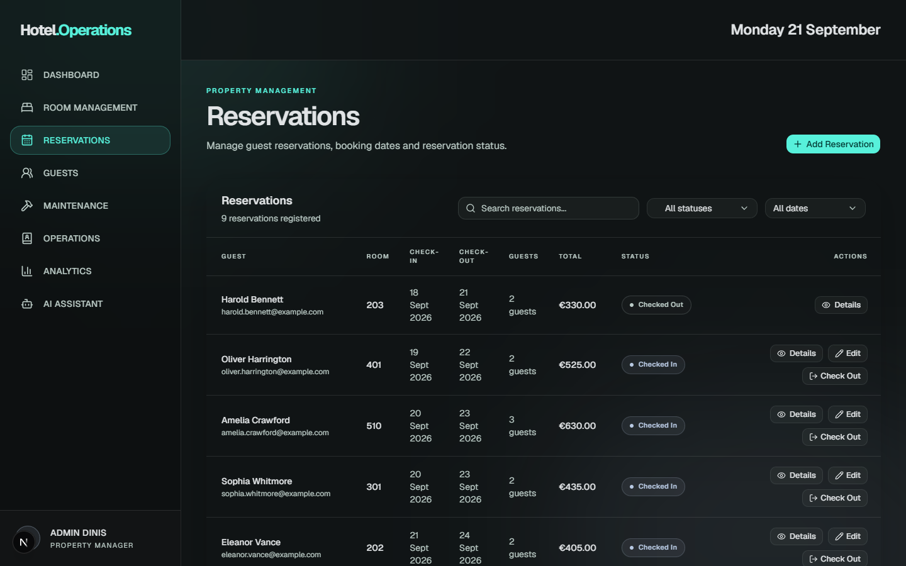
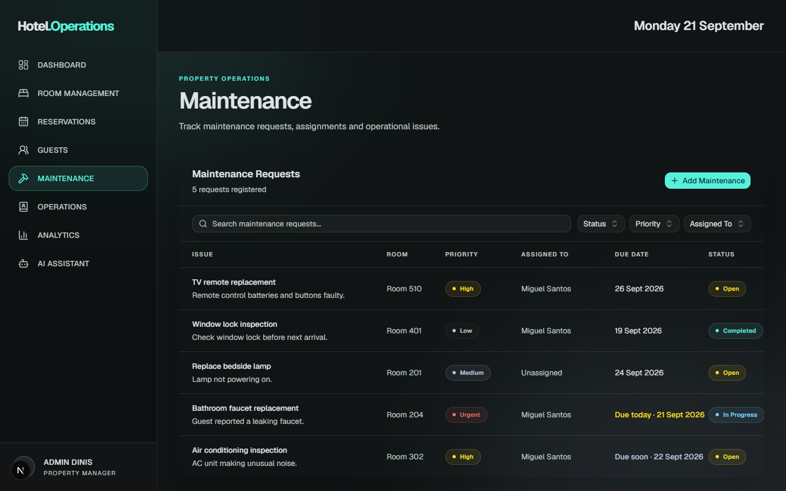
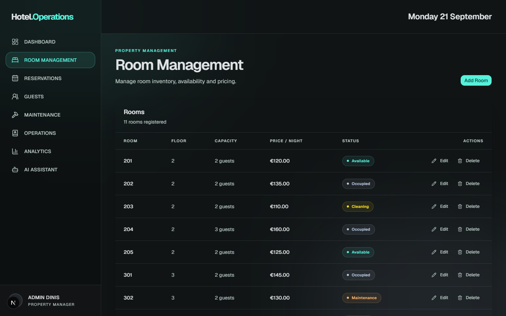
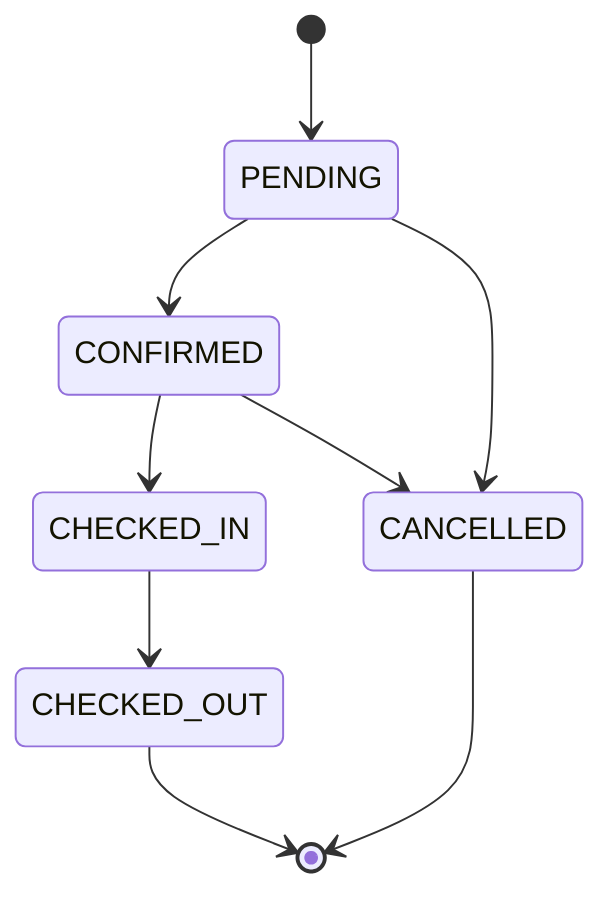

# Hotel.Operations

Plataforma de gestão hoteleira: reservas, quartos, hóspedes, manutenção e check-in/check-out num só painel.

**Estado:** em desenvolvimento.



## Demo

[dinisfragata.pt/projects/hotel-ai-assistant/demo](https://www.dinisfragata.pt/projects/hotel-ai-assistant/demo)

Todos os dados da demo são fictícios.

## Problema que resolve

Numa equipa de hotel pequena, reservas, estado dos quartos, pedidos de manutenção e chegadas do dia costumam estar espalhados por folhas de cálculo e mensagens. O Hotel.Operations junta tudo num painel e impede erros comuns: sobrepor reservas no mesmo quarto, fazer check-in num quarto que não está livre ou saltar passos no ciclo de uma reserva.

Projeto de portfólio, ainda não testado com hotéis reais.

## Funcionalidades

### Implementadas

- **Dashboard:** ocupação, check-ins e check-outs do dia, manutenção ativa, chegadas, partidas e hóspedes com pedidos especiais.
- **Reservas:** criar, editar e cancelar; pesquisa e filtros por estado e data; verificação de datas sobrepostas; preço total calculado no servidor.
- **Check-in e check-out:** fazem avançar a reserva, atualizam o estado do quarto e registam a operação.
- **Quartos:** criar, editar e apagar (um quarto com histórico de reservas, manutenção ou operações não pode ser apagado).
- **Hóspedes:** criar e editar, com idioma, tipo de quarto e pedidos especiais.
- **Manutenção:** pedidos com prioridade, responsável, prazo e histórico de alterações.
- **Operações:** registo de check-ins e check-outs, com filtros.
- **Analytics:** ocupação, receita, estado dos quartos, reservas e manutenção por período.
- **AI Assistant:** chat que consulta os dados reais do hotel (últimos 30 dias) e responde com cartões e gráficos. Usa o modelo `gpt-4o-mini` e precisa de `OPENAI_API_KEY`.

### Planeadas

- **AI Insights:** os alertas do dashboard são, por agora, dados de exemplo; ainda não são gerados por um modelo.
- **Autenticação e roles:** o modelo `User` já tem um campo `role`, mas ainda não existe login.
- **Testes automáticos.**

## Capturas de ecrã

| Reservas | Manutenção | Quartos |
|---|---|---|
|  |  |  |

## Stack

| | |
|---|---|
| Framework | Next.js 16.3.3 (App Router), React 19.2.8 |
| Linguagem | TypeScript 5 |
| Base de dados | PostgreSQL, Prisma 7.10 (com `@prisma/adapter-pg`) |
| Interface | Tailwind CSS 4, Base UI, Recharts 3.8 |
| Validação | Zod 4.5 |
| IA | Vercel AI SDK 7 (`ai`) + `@ai-sdk/openai`, modelo `gpt-4o-mini` |

## Decisões técnicas

### Server Components por omissão

Todas as páginas em `app/(dashboard)` são Server Components e vão buscar os dados diretamente à base de dados com Prisma. Só os componentes que precisam de interação (diálogos, filtros, o chat) são Client Components. As páginas que dependem da data de hoje usam `dynamic = "force-dynamic"` para não ficarem congeladas no build.

### Regras de negócio no servidor

Toda a escrita passa por Server Actions (`actions.ts` de cada módulo). Os dados do formulário são validados com Zod, o preço total e as datas são calculados no servidor e a disponibilidade do quarto é verificada antes de criar ou editar uma reserva. O cliente nunca decide o estado final.

### Máquina de estados das reservas

As transições permitidas estão definidas num único sítio, `lib/reservations/status.ts`, e todas as actions usam essa definição.



### Check-in e check-out como transações atómicas

`updateReservationStatus` corre dentro de `prisma.$transaction`. Volta a ler a reserva dentro da transação (para não agir sobre dados que outro pedido entretanto alterou) e, conforme o caso:

- **Check-in:** exige que o quarto esteja `AVAILABLE`; passa a reserva a `CHECKED_IN`, o quarto a `OCCUPIED` e cria a `Operation`.
- **Check-out:** passa a reserva a `CHECKED_OUT`, o quarto a `CLEANING` (se estava ocupado) e cria a `Operation`.

Se qualquer passo falhar, nada é gravado.

## Como correr localmente

**Pré-requisitos:** Node.js 20.19+ (ou 22.12+), npm e uma base de dados PostgreSQL (local ou, por exemplo, um projeto gratuito no [Neon](https://neon.tech)).

```bash
git clone https://github.com/DinisFragata/Hotel-AI-Assistent.git
cd Hotel-AI-Assistent
cp .env.example .env          # preenche DATABASE_URL (e OPENAI_API_KEY, se quiseres o AI Assistant)
npm install
npx prisma migrate deploy     # cria as tabelas
npm run db:seed               # carrega os dados de exemplo
npm run dev
```

Abre [http://localhost:3000](http://localhost:3000).

Sem `OPENAI_API_KEY` tudo funciona, exceto o AI Assistant.

### Repor os dados de exemplo

```bash
npm run db:seed
```

O seed **apaga todos os dados** das tabelas e volta a criar um hotel fictício e coerente (11 quartos, 9 hóspedes, 9 reservas). As datas são relativas ao dia em que corres o comando, por isso o dashboard mostra sempre chegadas e partidas de "hoje". Corre-o apenas contra uma base de dados de desenvolvimento ou de demonstração.

## Estrutura de pastas

```
app/
├── (dashboard)/        páginas e Server Actions de cada módulo
└── api/chat/           endpoint do AI Assistant
components/             componentes por módulo e componentes de UI
lib/                    regras de negócio (estados, validação, filtros, analytics)
prisma/                 schema, migrações e seed
docs/screenshots/       capturas de ecrã usadas neste README
```

## Roadmap

- [ ] Autenticação e roles
- [ ] AI Insights gerados pelo modelo
- [ ] Testes automáticos
- [ ] Testar com um hotel real

## Contacto

Dinis Fragata · [dinisfragata.pt](https://dinisfragata.pt) · [dinis@dinisfragata.pt](mailto:dinis@dinisfragata.pt)
