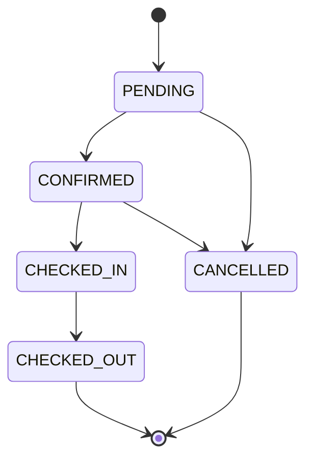

# Hotel.Operations

A hotel management platform: reservations, rooms, guests, maintenance and check-in/check-out in a single dashboard.

**Status:** in development.


## Demo

[dinisfragata.pt/projects/hotel-ai-assistant/demo](https://www.dinisfragata.pt/projects/hotel-ai-assistant/demo)

All demo data is fictional.

## The problem

In a small hotel team, reservations, room status, maintenance requests and the day's arrivals tend to be scattered across spreadsheets and messages. Hotel.Operations puts everything in one dashboard and prevents common mistakes: double-booking a room, checking a guest into a room that isn't free, or skipping steps in a reservation's lifecycle.

Portfolio project, not yet tested with real hotels.

## Features

### Implemented

- **Dashboard:** occupancy, today's check-ins and check-outs, active maintenance, arrivals, departures and guests with special requests.
- **Reservations:** create, edit and cancel; search and filters by status and date; overlapping-date check; total price calculated on the server.
- **Check-in and check-out:** advance the reservation, update the room status and log the operation.
- **Rooms:** create, edit and delete (a room with reservation, maintenance or operation history can't be deleted).
- **Guests:** create and edit, with language, room type and special requests.
- **Maintenance:** requests with priority, assignee, due date and a change history.
- **Operations:** log of check-ins and check-outs, with filters.
- **Analytics:** occupancy, revenue, room status, reservations and maintenance by period.
- **AI Assistant:** a chat that queries the hotel's real data (last 30 days) and answers with cards and charts. It uses the `gpt-4o-mini` model and needs `OPENAI_API_KEY`.

### Planned

- **AI Insights:** the alerts on the dashboard are sample data for now; they are not yet generated by a model.
- **Authentication and roles:** the `User` model already has a `role` field, but there is no login yet.
- **Automated tests.**

## Screenshots

| Reservations | Maintenance | Rooms |
|---|---|---|
|  |  |  |

## Stack

| | |
|---|---|
| Framework | Next.js 16.3.3 (App Router), React 19.2.8 |
| Language | TypeScript 5 |
| Database | PostgreSQL, Prisma 7.10 (with `@prisma/adapter-pg`) |
| UI | Tailwind CSS 4, Base UI, Recharts 3.8 |
| Validation | Zod 4.5 |
| AI | Vercel AI SDK 7 (`ai`) + `@ai-sdk/openai`, `gpt-4o-mini` model |

## Technical decisions

### Server Components by default

Every page in `app/(dashboard)` is a Server Component and reads from the database directly with Prisma. Only components that need interaction (dialogs, filters, the chat) are Client Components. Pages that depend on today's date use `dynamic = "force-dynamic"` so they aren't frozen at build time.

### Business rules on the server

All writes go through Server Actions (the `actions.ts` file of each module). Form data is validated with Zod, the total price and dates are computed on the server, and room availability is checked before a reservation is created or edited. The client never decides the final state.

### Reservation state machine

The allowed transitions are defined in one place, `lib/reservations/status.ts`, and all reservation actions use that definition.



### Check-in and check-out as atomic transactions

`updateReservationStatus` runs inside `prisma.$transaction`. It re-reads the reservation inside the transaction (so it never acts on data another request has just changed) and, depending on the case:

- **Check-in:** requires the room to be `AVAILABLE`; sets the reservation to `CHECKED_IN`, the room to `OCCUPIED` and creates the `Operation`.
- **Check-out:** sets the reservation to `CHECKED_OUT`, the room to `CLEANING` (if it was occupied) and creates the `Operation`.

If any step fails, nothing is saved.

## Running locally

**Prerequisites:** Node.js 20.19+ (or 22.12+), npm and a PostgreSQL database (local or, for example, a free project on [Neon](https://neon.tech)).

```bash
git clone https://github.com/DinisFragata/Hotel-AI-Assistent.git
cd Hotel-AI-Assistent
cp .env.example .env          # fill in DATABASE_URL (and OPENAI_API_KEY if you want the AI Assistant)
npm install
npx prisma migrate deploy     # create the tables
npm run db:seed               # load the sample data
npm run dev
```

Open [http://localhost:3000](http://localhost:3000).

Everything works without `OPENAI_API_KEY` except the AI Assistant.

### Resetting the sample data

```bash
npm run db:seed
```

The seed **deletes all data** in the tables and recreates a coherent fictional hotel (11 rooms, 9 guests, 9 reservations). Dates are relative to the day you run the command, so the dashboard always shows arrivals and departures for "today". Only run it against a development or demo database.

## Project structure

```
app/
├── (dashboard)/        pages and Server Actions for each module
└── api/chat/           AI Assistant endpoint
components/             per-module components and UI components
lib/                    business rules (status, validation, filters, analytics)
prisma/                 schema, migrations and seed
docs/screenshots/       screenshots used in this README
```

## Roadmap

- [ ] Authentication and roles
- [ ] AI Insights generated by the model
- [ ] Automated tests
- [ ] Test with a real hotel

## Contact

Dinis Fragata · [dinisfragata.pt](https://dinisfragata.pt) · [dinis@dinisfragata.pt](mailto:dinis@dinisfragata.pt)
